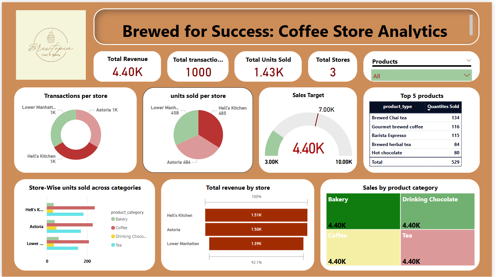

☕ Coffee Shop Sales Dashboard

📌 Project Overview

This project showcases a complete end-to-end business intelligence workflow using **SQL** and **Power BI**. The analysis focuses on a fictional multi-store coffee chain and provides key insights into revenue, sales trends, product performance, and customer behavior.

The main goal is to support business decisions such as identifying best-selling products, evaluating store performance, and tracking overall revenue through a visually rich and interactive dashboard.

---

📊 Objectives

- Analyze total revenue and units sold
- Identify top-performing products and stores
- Visualize daily revenue trends
- Track transactions by store and category
- Enable filtering and slicing by category, location, etc.
- Present KPIs and trends in a single-page dashboard

---

🧩 Tools & Technologies

- **SQL (MySQL)** – Data transformation, aggregation, and view creation  
- **Power BI Desktop** – Data modeling, dashboard creation, slicers, KPIs  
- **Excel** – Data cleaning, formatting, and normalization

---

🗃️ Dataset Details

The dataset consists of three core tables:

| Table Name     | Description                                         |
|----------------|-----------------------------------------------------|
| `products`     | Contains product ID, category, and type             |
| `stores`       | Contains store ID and store location                |
| `transactions` | Contains transaction ID, date, time, product ID, store ID, quantity sold, and unit price |

📂 Source:
This dataset was sourced from [Kaggle - Coffee Shop Sales (Maven Analytics)](https://www.kaggle.com/datasets/mahmoudmaher/coffee-shop-sales)  
Modified to include only **1000 transactions** for simplified analysis.

---

🧮 SQL Data Preparation

To improve performance and reusability, the data was pre-aggregated using SQL views:

- `store_revenue` – Total revenue per store  
- `top_5_products` – Best-selling products by quantity  
- `daily_revenue` – Revenue trend over time  
- `highest_transactions_stores` – Store-wise transaction volume  
- `average_transaction_value` – Avg. revenue per transaction/store  
- `store_product_sales` – Store-wise category sales  
- `ranked_products_by_revenue` – Product rankings by revenue  
- `daily_category_revenue` – Revenue trend by product category  
- `category_sales_summary` – Overall sales and transaction count by category  

All views are included in [`SQL_Queries.sql`](SQL_Queries.sql)

---

📊 Power BI Dashboard Highlights

### KPIs:
- Total Revenue  
- Total Units Sold  
- Number of Stores  
- Total Transactions  

### Visuals:
- ✅ Donut Chart – Transactions per Store  
- ✅ Pie Chart – Units Sold per Store  
- ✅ Gauge – Target Sales Achievement  
- ✅ Bar Chart – Revenue by Store  
- ✅ Clustered Bar – Category Sales by Store  
- ✅ Tree Map – Product Category Revenue  
- ✅ Funnel Chart – Revenue by Category  
- ✅ Table – Top 5 Best-Selling Products  
- ✅ Slicers – Filter by Product Category, Store Location

---

## 💡 Key Insights

- Hell’s Kitchen store generated the highest revenue and number of transactions.
- The top-selling product sold over 130 units.
- Bakery and Beverage categories account for the majority of revenue.
- Revenue trends and performance can be sliced by store or category for targeted analysis.

---

## 🧠 Learning Outcomes

- Practical application of **data normalization** and **relational modeling**
- Integration of SQL queries/views directly into **Power BI**
- Use of **interactive visuals and slicers** for dynamic analysis
- KPI storytelling through a **one-page executive dashboard**

---

## 📬 Contact

**Chaitrika Muthyala**  
🔗 [LinkedIn Profile](https://www.linkedin.com/in/chaitrikamuthyala/)  
💼 GitHub: https://github.com/chaitrika112002

---

## 📚 Reference

Dataset from Maven Analytics (via Kaggle):  
**Coffee Shop Sales** – [https://www.kaggle.com/datasets/mahmoudmaher/coffee-shop-sales](https://www.kaggle.com/datasets/mahmoudmaher/coffee-shop-sales)

